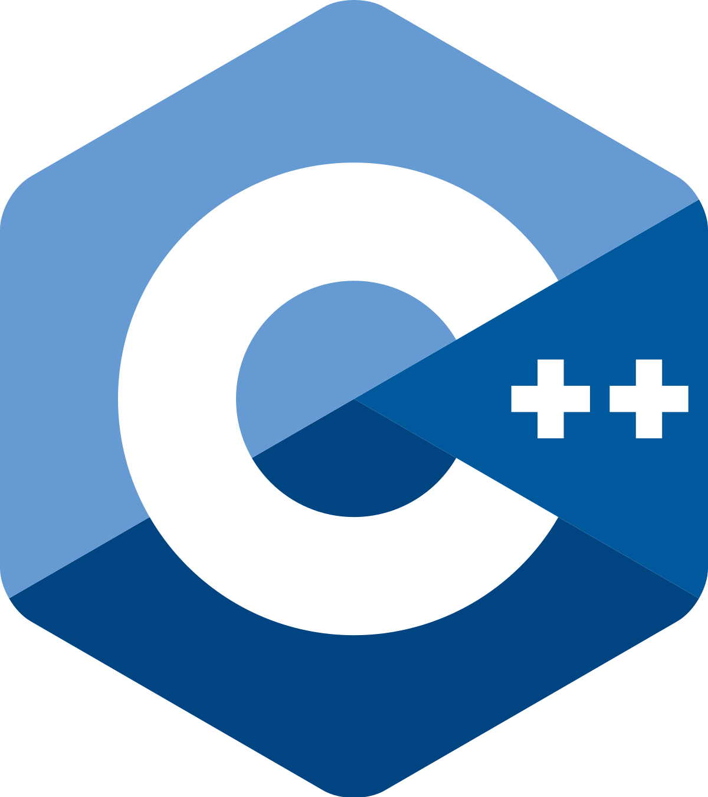

# About Peperehobbits01

Hi, I am Peperehobbits01! A small developer that likes to learn more, and that take time to make stuff correctly. Mostly working on my own project for now. I am may help open source project other then my own soon! I like privacy and think that it should be a standard. I am using Linux (not arch by the way even tho I would of wanted but, didn't have time for it) and I am working on what you could say big projects, like my Minecraft server!

# My skills right now and the now I am learning

## The ones I know :

</a></a></a></a>

## The ones I want to learn/I am learning :

</a></a></a></a></a>
